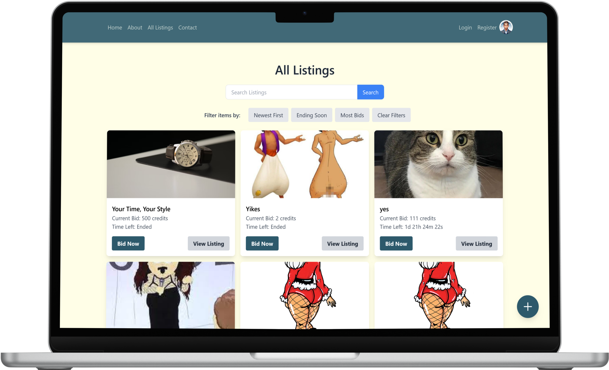

# Semester Project 2: Auction Website



This project is a front-end auction website built using **Tailwind CSS** and **Vite.js**. It allows users to create listings, bid on items, and manage their credits. Designed as a professional portfolio piece, this project demonstrates the application of modern web development practices, integration with APIs, and responsive design.

## Table of Contents

- [Project Overview](#project-overview)
- [Features](#features)
- [User Stories](#user-stories)
- [Technical Restrictions](#technical-restrictions)
- [Approved Resources](#approved-resources)
- [Setup & Running Locally](#setup--running-locally)
- [Testing](#testing)
- [Deployment](#deployment)
- [Contact](#contact)
- [License](#license)

## Project Overview

This auction website connects to the Noroff API to provide a platform for users to buy and sell items. Registered users receive 1000 credits initially. Unregistered users can browse listings, but only registered users can bid.

## Features

- **User Authentication:**
    - Registration for users with stud.noroff.no email addresses
    - Login/logout functionality
    - Avatar update
    - Credit balance display
- **Listing Management:**
    - Creation of listings with title, deadline, media, and description
- **Bidding:**
    - Adding bids to other users' listings
    - Viewing bids made on a listing
- **Searching:**
    - Unregistered users can search listings
- **Additional Features (Optional):**
    - Filter by recently created, ending soon, and by amount of bids

## User Stories

- As a user with a stud.noroff.no email, I can register for an account.
- As a registered user, I can log in and out of my account.
- As a registered user, I can update my avatar image.
- As a registered user, I can view my total credit balance.
- As a registered user, I can create a listing with a title, deadline, media, and description.
- As a registered user, I can add a bid to another user's listing.
- As a registered user, I can view all bids made on a specific listing.
- As an unregistered user, I can search through listings to find items of interest.

## Technical Restrictions

- **CSS Framework:** Tailwind CSS (version > 3.4.3)
- **Static Host:** Netlify
- **Design Application:** Figma
- **Planning Application:** Kanban Board & Gantt Chart

## Approved Resources

- **CSS Processors:** Tailwind CSS, PostCSS
- **Hosting Services:** Netlify
- **Design Applications:** Adobe XD, Figma, Sketch
- **Planning Applications:** Trello, GitHub Projects

## Setup & Running Locally

1. **Clone the repository:** 
    ```bash
    git clone https://github.com/chralmli/gavel-glance-SP2
    ```

2. **Navigate to the project directory:**
    ```bash
    cd gavel-glance-SP2
    ```

3. **Install dependencies:**
    ```bash
    npm install
    ```

4. **Start development server:**
    ```bash
    npm run dev
    ```

## Testing

- **Unit Tests:** Run `npm run test:unit` to execute Jest unit tests.
- **End-to-end Tests:** Run `npm run test:e2e` to execute Cypress end-to-end tests.


## Deployment

This project is deployed to Netlify and will automatically update upon successful completion of the CI pipeline.

## Contact

For any inquiries or feedback, feel free to reach out:

- **GitHub**: [yourusername](https://github.com/chralmli)
- **LinkedIn**: [Your Name](https://www.linkedin.com/in/christian-almli-4b82b8196/)

## License

This project is not licensed for public use. Contact me for details.